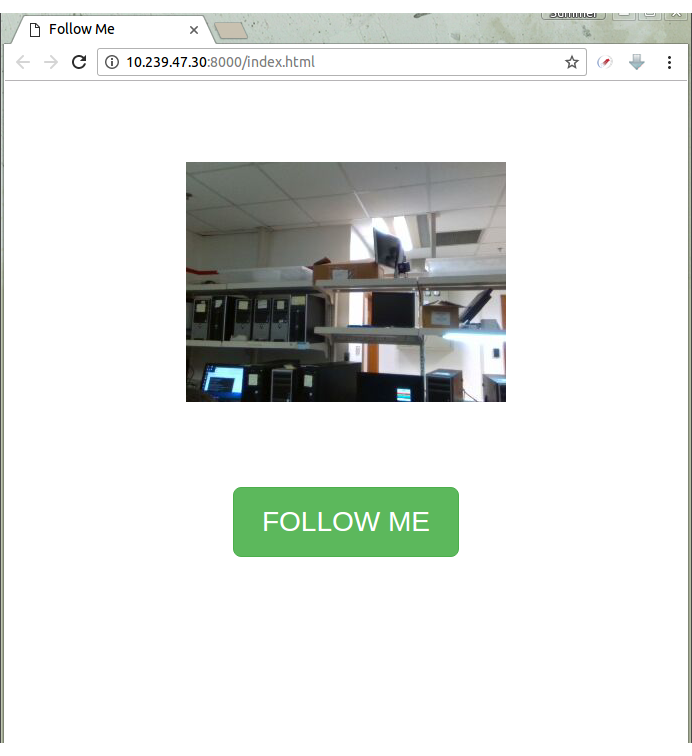

# follow_me.js

A person following robot demo by using `node-realsense` and DFRobot HCR JavaScript API.

## Prerequisites

### HardWare

- [Intel® Joule™ Module](https://software.intel.com/en-us/iot/hardware/joule)
- [Intel® RealSense™ Camera ZR300](https://newsroom.intel.com/chip-shots/intel-announces-tools-realsense-technology-development/)
- [DFRobot HCR platform](https://www.dfrobot.com/product-361.html)

### Setup RealSense Execution Environment on Joule

- Operating System: Ubuntu 16.04 LTS is recommended.
    - Following this [Installation Guide](https://developer.ubuntu.com/core/get-started/intel-joule#alternative-install:-ubuntu-desktop-16.04-lts) to install Ubuntu Operating System. Make sure you choose `Alternative install: Ubuntu Desktop 16.04 LTS`. A direct (but temporary) link to [*.iso image](http://people.canonical.com/~platform/snappy/tuchuck/desktop-beta4/tuchuck-xenial-desktop-iso-20170109-0.iso).
    - Please be noted that Intel® Joule™ Module might need a [BIOS update](https://software.intel.com/en-us/flashing-the-bios-on-joule) before installing an Operating System ([firmware v174](https://downloadmirror.intel.com/26206/eng/Joule-Firmware-2016-12-18-174-Public.zip) or above)

- Build Environment: Please refer to this [tutorial](https://software.intel.com/sites/products/realsense/intro/getting_started.html) for details introduction.

```
# You know what they are
sudo apt-get install nodejs npm

# An optional workaround of "Node not found" error
sudo ln -s /usr/bin/nodejs /usr/bin/node

# Install the build tool for Node.js C++ add-on
npm install -g node-gyp
```

## Bootstrap
```
$ npm install
```

## Run

```
$ node main.js
```

Open web browser and navigate to the `http://Device_IP:8000/index.html`.
Press the `FOLLOW ME` to start.

## Screenshot

